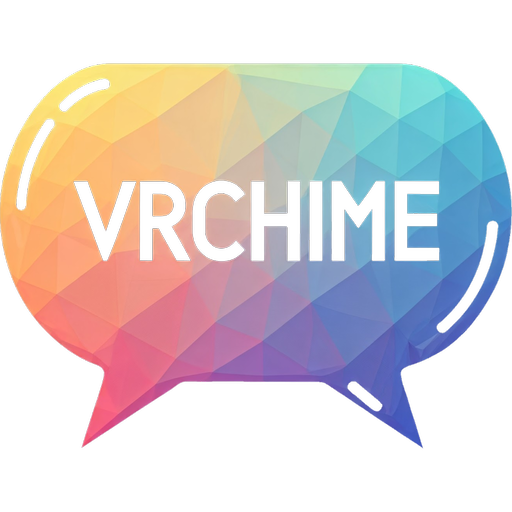
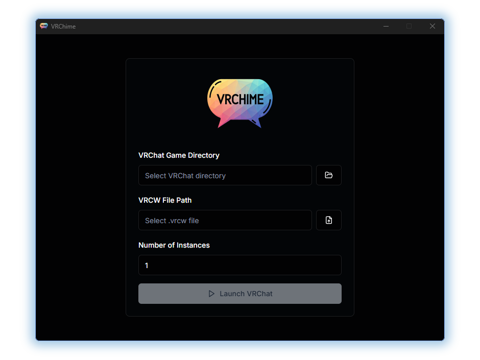

  
  <h1>VRChime</h1>
  
A desktop app for testing VRChat worlds from a .vrcw file. Configure instances, select the VRChat directory, and launch with custom settings.

## ✨ Features

- **Multiple VRChat Instances**: Launch multiple VRChat instances in parallel with a single click.
- **Custom `.vrcw` Support**: Easily select and launch VRChat with your `.vrcw` file.
- **Simple UI**: Intuitive, minimal, and easy-to-use interface.
- **Cross-platform**: Powered by Tauri, VRChime can run on Windows, macOS, and Linux.

## 📸 Screenshots

## 🎛️ Usage

1. Launch VRChime.
2. Select your **VRChat Game Directory**.
3. Select your **VRCW File**.
4. Set the number of **instances** you want to launch.
5. Click **Launch VRChat** to start the instances.

## 🧑‍💻 Contributing

We welcome contributions from the community! If you’d like to add new features, improve the code, or report issues, feel free to submit a pull request or open an issue on GitHub.

### Steps to contribute

1. Fork the repository.
2. Create a new feature branch (`git checkout -b feature/new-feature`).
3. Commit your changes (`git commit -am 'Add new feature'`).
4. Push the branch (`git push origin feature/new-feature`).
5. Open a Pull Request.

## 📝 License

This project is licensed under the MIT License. See the [LICENSE](LICENSE) file for details.
  
---

*Happy VR adventuring with VRChime!* 🎉
